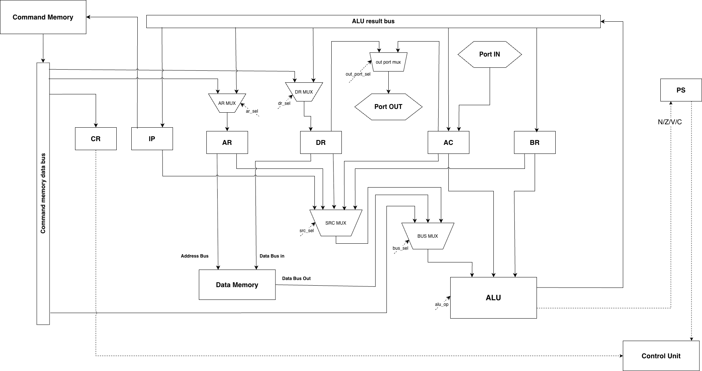
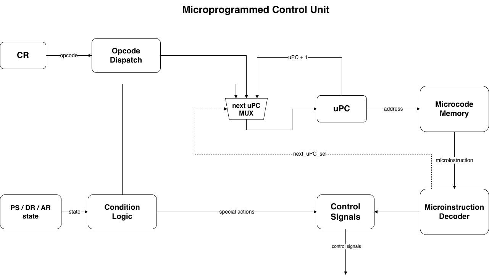

# Лабораторная работа №4. Эксперимент

ФИО: Кузьмин Дмитрий Анатольевич

Группа: P3209

Вариант:

```text
asm | cisc | harv | mc | tick | binary | stream | port | cstr | prob1
```

Проект реализует ассемблер, транслятор в бинарный машинный код, модель
микропрограммного процессора и golden tests для проверки всей цепочки.

## Язык программирования

Входной язык - ассемблер. Программа состоит из директив, меток, инструкций и
данных. Транслятор выполняет двухпроходную сборку: сначала вычисляет адреса
меток и размещение секций, затем генерирует образ памяти команд, образ памяти
данных, бинарный файл и debug dump.

### Синтаксис

Комментарии начинаются с `;` и продолжаются до конца строки. Символ `#`
обозначает immediate-операнд.

```bnf
<program>      ::= { <line> }
<line>         ::= [ <label> ":" ] [ <statement> ] [ <comment> ]
<label>        ::= <identifier>
<statement>    ::= <directive> | <instruction> | <data-item>

<directive>    ::= ".section" ("text" | "data")
                 | ".org" <number>
                 | ".const" <identifier> <number>
                 | ".macro" <identifier> { <identifier> } <macro-body> ".endmacro"
                 | ".ifdef" <identifier>
                 | ".ifndef" <identifier>
                 | ".ifconst" <identifier>
                 | ".else"
                 | ".endif"

<instruction>  ::= <mnemonic>
                 | <mnemonic> <operand-list>
<operand-list> ::= <operand> { "," <operand> }
<operand>      ::= <data-register>
                 | <address-register>
                 | <special-register>
                 | "(" <address-register> ")"
                 | "(" <address-register> ")+"
                 | "-(" <address-register> ")"
                 | "#" (<number> | <char> | <identifier>)
                 | <number>
                 | <char>
                 | <identifier>

<data-register>    ::= "R1" | "R2" | "R3"
<address-register> ::= "A1" | "A2" | "A3"
<special-register> ::= "ZERO"
<data-item>        ::= ".word" (<number> | <char> | <identifier>)
                     | ".cstr" <string>

<number>       ::= decimal | hexadecimal-with-0x-prefix
<char>         ::= "'" <one-character> "'"
<string>       ::= "\"" { <character> } "\""
<identifier>   ::= letter { letter | digit | "_" }
```

`CSTR` имеет отдельный синтаксис:

```asm
CSTR A2, "text"
```

Первый операнд обязан быть адресным регистром `A1..A3`; строковый литерал
кодируется байтами прямо в памяти команд и завершается нулевым байтом.

### Семантика языка

Стратегия вычислений последовательная: инструкции выполняются по возрастанию
`IP`, пока поток управления не изменён переходом или пока не выполнена
остановка.

Все метки имеют глобальную область видимости. Метка в секции `text` обозначает
адрес байта в памяти команд, метка в секции `data` обозначает адрес слова в
памяти данных. Точка входа задаётся обязательной меткой `_start` в секции
`text`.

Типизация машинная:

- инструкция хранится в памяти команд как opcode и операнды;
- слово данных хранится в памяти данных как 32-битное знаковое значение;
- символ выводится младшим байтом значения;
- `.cstr` размещает каждый символ в отдельном слове памяти данных и добавляет
  нулевой терминатор;
- immediate-операнды обычных инструкций занимают 2 байта signed payload;
- прямые адреса данных и адреса переходов занимают 2 байта payload;
- косвенная адресация использует значение одного из `A1..A3`.

Макросы раскрываются текстово до разбора секций и меток. Условная компиляция
работает по объявленным константам и макросам:

- `.ifdef NAME` активен, если `NAME` определён как `.const` или `.macro`;
- `.ifndef NAME` активен, если `NAME` не определён;
- `.ifconst NAME` активен, если `NAME` определён как `.const`;
- `.else` и `.endif` завершают условный блок.

## Организация памяти

Архитектура памяти - Harvard:

- память команд: `2^16` ячеек по 8 бит;
- память данных: `2^16` ячеек по 32 бита;
- память микрокода: до 256 микрокоманд.

Память команд и память данных разделены. Инструкции, статические данные и
строки не смешиваются.

```text
Command memory, 8-bit cells
+--------------------------------+
| opcode                          |
| operand kinds                   |
| op0 payload high                |
| op0 payload low                 |
| op1 payload high                |
| op1 payload low                 |
| ...                             |
+--------------------------------+

Data memory, 32-bit cells
+--------------------------------+
| .word / .cstr char              |
| .word / .cstr char              |
| ...                             |
+--------------------------------+
```

Регистры и внутренние защёлки:

| Регистр | Размер | Назначение |
| --- | ---: | --- |
| `R1..R3` | 32 бита | Регистры данных общего назначения. |
| `A1..A3` | 16 бит | Адресные регистры для косвенной адресации. |
| `ZERO` | 32 бита | Специальный источник нуля; запись игнорируется. |
| `IP` | 16 бит | Адрес следующего байта команды. |
| `CR` | 8 бит | Opcode текущей инструкции. |
| `OKR` | 8 бит | Типы операндов: старшие 4 бита - первый операнд, младшие 4 бита - второй. |
| `OP0`, `OP1` | 16 бит | Payload-регистры операндов. Для `CSTR` `OP1` используется как регистр текущего символа. |
| `EA0`, `EA1` | 16 бит | Подготовленные effective address для первого и второго операнда. |
| `PS` | 4 бита | Флаги `N`, `Z`, `V`, `C`. |
| `shadow_r0` | 32 бита | Значение source-операнда или текущий символ строки. |
| `shadow_r1` | 32 бита | Старое значение destination-операнда перед ALU. |
| `shadow_r2` | 32 бита | Результат ALU для memory write-back и обновления `EA` в `OUT_CSTR`. |
| `shadow_a0` | 16 бит | Временный адрес для `INC/DEC` адресных значений. |

## Система команд

Архитектура команд - CISC: одна мнемоника работает с несколькими режимами
адресации.

Режимы адресации:

- `R1`, `R2`, `R3` - регистр данных;
- `A1`, `A2`, `A3` - адресный регистр;
- `ZERO` - специальный источник нуля;
- `label` - прямое обращение к памяти данных;
- `(A1)` - косвенное обращение к памяти данных;
- `(A1)+` - post-increment: используется старый адрес, затем `A1 <- A1 + 1`;
- `-(A1)` - pre-decrement: сначала `A1 <- A1 - 1`, затем используется новый адрес;
- `#value` - immediate.

Сложные строковые инструкции:

- `OUT_CSTR addr` выводит null-terminated строку из памяти данных через порт `0`;
- `CSTR A?, "text"` записывает строку и нулевой терминатор в память данных,
  начиная с адреса в `A?`, и после каждого записанного байта увеличивает `A?`.

### Кодирование

Байт opcode всегда первый. Для обычных инструкций количество операндов
определяется opcode. Если операнды есть, после opcode хранится байт `operand
kinds`: старшие 4 бита кодируют тип первого операнда, младшие 4 бита - тип
второго. Затем идут 2-байтные payload-ы операндов.

```text
0 operands: opcode
1 operand : opcode, kinds, op0_hi, op0_lo
2 operands: opcode, kinds, op0_hi, op0_lo, op1_hi, op1_lo
```

Например, `MOV #10, R1`:

```text
03 51 00 0A 00 01
|  |  |     |
|  |  |     +-- payload R1 = 1
|  |  +-------- payload #10 = 10
|  +----------- src kind = 5 immediate, dst kind = 1 data register
+-------------- opcode MOV
```

`CSTR` использует специальный формат:

```text
opcode, address_register_number, char0, char1, ..., 0
```

Например, `CSTR A2, "OK"`:

```text
14 02 4F 4B 00
```

Коды типов операндов:

| Тип | Код | Payload |
| --- | ---: | --- |
| `R1..R3` | `0x01` | Номер регистра |
| `A1..A3` | `0x02` | Номер регистра |
| `label` | `0x03` | Адрес данных |
| `(A1)..(A3)` | `0x04` | Номер адресного регистра |
| `#value` | `0x05` | Signed int16 |
| `port` | `0x06` | Номер порта |
| `label` перехода | `0x07` | Адрес команды |
| адрес `.cstr` | `0x08` | Адрес данных |
| `ZERO` | `0x09` | Номер спецрегистра |
| `(A1)+` | `0x0A` | Номер адресного регистра |
| `-(A1)` | `0x0B` | Номер адресного регистра |

Инструкции:

| Инструкция | Opcode | Семантика |
| --- | ---: | --- |
| `HLT` | `0x01` | Остановить модель. |
| `NOP` | `0x02` | Нет операции. |
| `MOV src, dst` | `0x03` | `dst <- src`, через `ALU PASS`, без изменения флагов. |
| `ADD src, dst` | `0x04` | `dst <- dst + src`. |
| `SUB src, dst` | `0x05` | `dst <- dst - src`. |
| `INC dst` | `0x06` | `dst <- dst + 1`. |
| `DEC dst` | `0x07` | `dst <- dst - 1`. |
| `CMP src, dst` | `0x08` | Выставить флаги для `dst - src`. |
| `BEQ addr` | `0x09` | `IP <- addr`, если `Z = 1`. |
| `BNE addr` | `0x0A` | `IP <- addr`, если `Z = 0`. |
| `BLT addr` | `0x0B` | `IP <- addr`, если `N = 1`. |
| `BGT addr` | `0x0C` | `IP <- addr`, если `N = 0` и `Z = 0`. |
| `JMP addr` | `0x0D` | `IP <- addr`. |
| `IN port, dst` | `0x0E` | `dst <- input_port[port]`. |
| `OUT src, port` | `0x0F` | `output_port[port] <- src & 0xFF`. |
| `OUT_CSTR addr` | `0x10` | Вывести C-строку из памяти данных через порт `0`. |
| `MUL src, dst` | `0x11` | `dst <- dst * src`. |
| `DIV src, dst` | `0x12` | `dst <- dst / src`, целочисленно. |
| `MOD src, dst` | `0x13` | `dst <- dst % src`. |
| `CSTR A?, "text"` | `0x14` | Записать C-строку в память данных, начиная с адреса в `A?`. |
| `NEG dst` | `0x15` | `dst <- -dst`. |
| `OR src, dst` | `0x16` | `dst <- dst \| src`. |
| `AND src, dst` | `0x17` | `dst <- dst & src`. |

`JUMP addr` поддерживается как псевдоним `JMP addr`.

## Такты и микротакты

Модель исполняется с точностью до такта. Один tick выполняет одну микрокоманду
из памяти микрокода.

Обозначения:

- `P` - суммарное число тактов подготовки effective address всех операндов;
- `W` - дополнительный такт записи результата в память данных;
- `L` - число ненулевых символов строки;
- `Z = L + 1` - длина C-строки с нулевым терминатором.

| Что считается | Такты |
| --- | ---: |
| Подготовка адреса для `R`, `A`, `#value`, `port`, `ZERO` | `0` |
| Подготовка адреса для `label`, `OUT_CSTR label`, `JMP label`, `(A)` | `1` |
| Подготовка адреса для `(A)+` | `2` |
| Подготовка адреса для `-(A)` | `3` |
| `HLT`, `NOP` | `2` |
| `BEQ`, `BNE`, `BLT`, `BGT`, `JMP` | `3 + P` |
| `IN`, `OUT` | `4 + P` |
| `MOV` | `5 + P + W` |
| `INC`, `DEC`, `NEG` | `4 + P + W` |
| `CMP` | `6 + P` |
| `ADD`, `SUB`, `MUL`, `DIV`, `MOD`, `OR`, `AND` | `6 + P + W` |
| `OUT_CSTR addr` | `3 + P + 5L` |
| `CSTR A?, "text"` | `2 + 6Z` |

`W = 1`, если destination расположен в памяти данных; иначе `W = 0`. Если
destination является `R1..R3`, `A1..A3` или `ZERO`, микропереход
`STORE_DST_IF_MEMORY` завершает инструкцию без отдельного write-back такта.

Примеры:

| Команда | Расчёт | Такты |
| --- | --- | ---: |
| `MOV #5, R1` | `5 + 0 + 0` | 5 |
| `MOV R1, value` | `5 + 1 + 1` | 7 |
| `ADD R1, R2` | `6 + 0 + 0` | 6 |
| `ADD value, R2` | `6 + 1 + 0` | 7 |
| `ADD R1, (A1)` | `6 + 1 + 1` | 8 |
| `INC (A1)+` | `4 + 2 + 1` | 7 |
| `OUT_CSTR msg`, где `msg = "OK"` | `3 + 1 + 5*2` | 14 |
| `CSTR A2, "OK"` | `2 + 6*3` | 20 |

## DataPath



DataPath состоит из памяти команд, памяти данных, регистрового файла,
мультиплексоров операндов, ALU, регистра флагов и внутренних shadow-регистров.
ControlUnit и память микрокода находятся отдельно: они только выдают
управляющие сигналы для DataPath.

Основные пути данных:

1. `IP -> Command Memory -> command value bus`.
2. `command value bus -> CR | OKR`, `OP0`, `OP1`.
3. `OP0/OP1/OKR -> OP MUX`: выбирается payload и тип текущего операнда.
4. `OP MUX`, `Data registers`, `Address registers`, `ZERO`, `data bus out`
   выбираются через `SRC MUX` и защёлкиваются в `shadow_r0`.
5. `Data registers`, `Address registers`, `data bus out` выбираются через
   `DST MUX` и защёлкиваются в `shadow_r1`.
6. `OP MUX` и `Address registers` выбираются через `EA MUX` и защёлкиваются
   в `EA0/EA1`.
7. `shadow_r1`, `shadow_a0` и `shadow_r0` поступают на левый вход ALU.
8. `shadow_r0` поступает на правый вход ALU; для `NEG` ноль берётся внутри ALU.
9. ALU пишет результат сразу в выбранный destination-регистр, выбранный
   адресный регистр или в `shadow_r2` для последующей записи в память.
10. `shadow_r2` идёт в `DATA IN` памяти данных.
11. `data bus out` возвращает прочитанное из памяти значение в `SRC MUX` или
    `DST MUX`.

`MOV` проходит через ALU как `PASS` без записи `PS`. Арифметические операции
записывают `PS`, если микросигнал `write_flags=True`.

## ControlUnit и микрокод



ControlUnit микропрограммный. Единственный архитектурный счётчик внутри него -
`uPC`, адрес текущей микрокоманды. Остальная информация берётся из DataPath:
`CR`, `OKR`, `OP0`, `OP1`, `EA0/EA1`, `PS` и shadow-регистров.

Микрокоманда в Python представлена списком микросигналов. Примеры сигналов:

| Сигнал | Действие |
| --- | --- |
| `LatchFetch` | Прочитать opcode и, для обычной команды, `OKR`. |
| `LatchSrcPayload`, `LatchDstPayload` | Прочитать 16-битный payload в `OP0`/`OP1`. |
| `LatchCstrAddressRegister` | Прочитать номер `A`-регистра команды `CSTR`. |
| `LatchCstrChar` | Прочитать байт строки `CSTR` в `OP1`. |
| `LatchEa` | Записать effective address в `EA0/EA1`. |
| `LatchShadowR0`, `LatchShadowR1`, `LatchShadowA0` | Защёлкнуть значение на внутреннем регистре. |
| `AluSignal` | Выполнить операцию ALU; результат может попасть в регистр, адресный регистр или `shadow_r2`, возможно записать `PS`. |
| `WriteDst` | Записать `shadow_r2` в destination памяти данных. |
| `BranchSignal`, `InputSignal`, `OutputSignal` | Специальные действия перехода и портов. |
| `LatchMpc` | Изменить `uPC`. |

Основные адреса микропрограмм:

| `uPC` | Назначение |
| ---: | --- |
| `0x00` | Common fetch. |
| `0x01..0x02` | Чтение payload первого и второго операнда. |
| `0x03..0x09` | Подготовка effective address, включая `(A)+` и `-(A)`. |
| `0x0A..0x10` | `CSTR`. |
| `0x11..0x12` | `HLT`, `NOP`. |
| `0x13..0x14` | `MOV`. |
| `0x15..0x23` | `ADD`, `SUB`, `MUL`, `DIV`, `MOD`. |
| `0x24..0x2F` | `NEG`, `OR`, `AND`, `INC`, `DEC`. |
| `0x30..0x33` | `CMP` и общий memory write-back. |
| `0x34..0x38` | Ветвления и `JMP`. |
| `0x39..0x3A` | `IN`, `OUT`. |
| `0x3B..0x3F` | `OUT_CSTR`. |

`LatchMpc` поддерживает не только `NEXT` и `ZERO`, но и условные переходы
микрокода:

- `FETCH_SRC_OR_DISPATCH` и `FETCH_DST_OR_PREPARE` пропускают лишние стадии
  fetch для инструкций с меньшим числом операндов;
- `PREPARE_OR_DISPATCH` продолжает подготовку адресов, пока она нужна;
- `STORE_DST_IF_MEMORY` добавляет такт write-back только для destination в
  памяти;
- `CSTR_DONE_OR_NEXT_CHAR` повторяет тело `CSTR`, пока записанный символ не
  равен нулю;
- `CSTR_LOOP_OR_FETCH` повторяет тело `OUT_CSTR`, пока прочитанный символ не
  равен нулю.

### Примеры микротактов

`MOV #5, R1`:

```text
FETCH -> FETCH_SRC_PAYLOAD -> FETCH_DST_PAYLOAD
LatchShadowR0
ALU PASS, write_flags=False, dst=DST_OR_SHADOW_R2
```

`ADD R1, R2`:

```text
FETCH -> FETCH_SRC_PAYLOAD -> FETCH_DST_PAYLOAD
LatchShadowR1        ; R2
LatchShadowR0        ; R1
ALU ADD, write_flags=True, dst=DST_OR_SHADOW_R2
```

`CSTR A2, "OK"`:

```text
FETCH
LatchCstrAddressRegister    ; OP0 = A2
LatchCstrChar               ; OP1 = 'O'
LatchShadowR0(OP1)
ALU PASS -> shadow_r2
WriteCstrChar               ; DataMem[A2] <- shadow_r2
LatchShadowA0               ; A2
ALU INC -> A2
... repeat for 'K' and 0
```

`OUT_CSTR msg`:

```text
FETCH -> FETCH_SRC_PAYLOAD
LatchEa(OPERAND_PAYLOAD)    ; EA0 = msg
LatchShadowR0FromDataMemory
OutputShadowR0
LatchShadowA0FromEa
ALU INC -> shadow_r2
LatchEaFromShadowR2
... repeat until 0
```

## Формат бинарного файла

Машинный код хранится в бинарном формате `AK4B`.

```text
offset  size  description
0       4     magic bytes: "AK4B"
4       2     entry point, uint16 big-endian
6       2     command memory image length, uint16 big-endian
8       2     data memory image length, uint16 big-endian
10      N     command memory image, bytes
10+N    4*M   data memory image, int32 words, big-endian
```

Память команд сохраняется плотным префиксом до последнего использованного
байта. Память данных сохраняется плотным префиксом до последнего
использованного слова. Если `.org` создаёт пропуск, в бинарный образ попадают
нули.

Транслятор создаёт debug dump вида:

```text
0000 - 0351000A0001 - MOV #10, R1
0006 - 10800000 - OUT_CSTR msg
```

## Trace

Trace пишется построчно. Каждая строка соответствует одному tick.

```text
tick=61 mode=scalar uPC=043 IP=0027 CR=05 R1=999 R2=0 R3=0 A1=000C A2=0000 A3=0000 PS=N0Z0V0C0
```

Строка содержит:

- номер такта;
- режим `scalar`;
- `uPC`;
- `IP`, `CR`;
- `R1..R3`, `A1..A3`;
- флаги `N`, `Z`, `V`, `C`;
- событие ввода-вывода или подготовки `EA`, если оно произошло.

## Ввод-вывод

Вариант `stream` реализован через буферы символов:

- входной поток хранится как список кодов символов;
- `IN 0, dst` извлекает один символ из входного буфера;
- если входной буфер пуст, моделирование останавливается;
- `OUT src, 0` добавляет `src & 0xFF` в выходной буфер;
- поддерживается только порт `0`.

`OUT_CSTR addr` также пишет в порт `0`, но номер порта не является операндом
инструкции: операндом является адрес C-строки в памяти данных.

## Строки

Статические строки задаются директивой `.cstr` в секции данных:

```asm
.section data
msg:
    .cstr "OK"
```

В памяти данных:

```text
DataMem[msg + 0] = 'O'
DataMem[msg + 1] = 'K'
DataMem[msg + 2] = 0
```

Динамическая запись строки выполняется командой:

```asm
MOV #msg, A2
CSTR A2, "OK"
```

После выполнения `CSTR` память содержит строку `OK\0`, а `A2` указывает на
ячейку после нулевого терминатора.

## Алгоритм варианта: `prob1`

Вариант `prob1` - Project Euler problem 4: найти наибольший палиндром,
являющийся произведением двух трёхзначных чисел.

Программа находится в [prob1.asm](prob1.asm), golden-версия -
[tests/golden/prob1.yml](tests/golden/prob1.yml).

Алгоритм:

1. `i` идёт от `999` до `100`.
2. `j` идёт от `990` до `100` с шагом `11`.
3. Шаг `11` используется потому, что каждый шестизначный палиндром делится на
   `11`; значит, хотя бы один множитель должен быть кратен `11`.
4. Считается `product = i * j`.
5. Если `product <= best`, внутренний цикл можно завершить для текущего `i`.
6. Иначе число проверяется на палиндром через `DIV 10`, `MOD 10` и построение
   обратного числа.
7. Если обратное число равно исходному произведению, обновляется `best`.
8. После завершения перебора `best` печатается по цифрам.

Результат:

```text
906609
```

## Тестирование

Golden tests организованы в формате `tests/golden/<case>.yml`. Каждый YAML-файл
содержит исходный asm, входной поток, лимит тактов и ожидаемые результаты. Для
каждого кейса проверяются:

1. бинарная трансляция и debug dump;
2. полный hex-образ бинарника, включая память команд и память данных;
3. вывод модели процессора;
4. полный trace для всех кейсов, кроме `prob1`; для `prob1` проверяются
   первые 1000 строк trace.

Покрытые golden-сценарии:

| Тест | Golden | Что проверяет |
| --- | --- | --- |
| `hello` | [tests/golden/hello.yml](tests/golden/hello.yml) | `.cstr`, `OUT_CSTR`, вывод строки. |
| `cat` | [tests/golden/cat.yml](tests/golden/cat.yml) | Потоковый ввод через `IN` и вывод через `OUT`. |
| `hello_user_name` | [tests/golden/hello_user_name.yml](tests/golden/hello_user_name.yml) | Диалоговый ввод-вывод. |
| `sort` | [tests/golden/sort.yml](tests/golden/sort.yml) | Косвенная адресация, память данных, сортировка. |
| `double_precision` | [tests/golden/double_precision.yml](tests/golden/double_precision.yml) | Арифметика двойной точности на паре 32-битных слов. |
| `prob1` | [tests/golden/prob1.yml](tests/golden/prob1.yml) | Алгоритм варианта, результат `906609`. |
| `features_preprocessor` | [tests/golden/features_preprocessor.yml](tests/golden/features_preprocessor.yml) | Константы, макросы, `.ifdef/.ifndef/.ifconst`, результат препроцессинга. |
| `features_addressing` | [tests/golden/features_addressing.yml](tests/golden/features_addressing.yml) | `.org`, секции, `(A)+`, `-(A)` и изменение адресного регистра. |
| `features_cisc_registers` | [tests/golden/features_cisc_registers.yml](tests/golden/features_cisc_registers.yml) | `CSTR`, `OUT_CSTR`, `ZERO`, `OR`, `AND`, `NEG`, работа `R2/R3` и `A2/A3`. |
